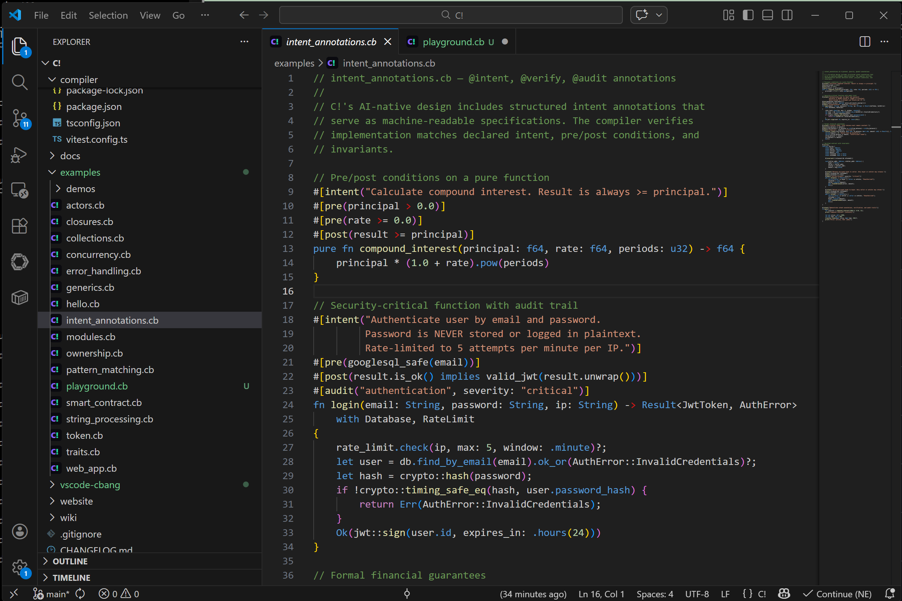

# C! (C-Bang) for Visual Studio Code

Syntax highlighting, snippets, and language support for [C! (C-Bang)](https://c-bang.integsec.com), the programming language designed for AI-human collaboration with security by construction.



## Features

- **Syntax highlighting** for all C! constructs — actors, contracts, components, servers, functions, enums, and more
- **30+ code snippets** for common patterns (fn, actor, contract, match, intent annotations, etc.)
- **Intent annotation highlighting** — `#[intent(...)]`, `#[verify(...)]`, `#[pre(...)]`, `#[post(...)]`, `#[invariant(...)]`
- **String interpolation** support with `{expr}` inside strings
- **Problem matcher** for `cbang check` output — see errors inline in the editor
- **File icon** for `.cb` files
- Comment toggling, bracket matching, auto-closing pairs, and code folding

## Snippets

Type the prefix and press Tab to expand:

| Prefix | Expands to |
|--------|-----------|
| `fn` | Function declaration |
| `pubfn` | Public function |
| `purefn` | Pure function |
| `asyncfn` | Async function |
| `actor` | Actor with state and handler |
| `contract` | Smart contract |
| `server` | HTTP server with route |
| `component` | UI component |
| `enum` | Enum declaration |
| `type` | Struct/type declaration |
| `let` | Immutable binding |
| `letmut` | Mutable binding |
| `match` | Match expression |
| `for` | For-in loop |
| `while` | While loop |
| `if` / `ifelse` | If / if-else |
| `intent` | `#[intent("...")]` |
| `pre` / `post` | Pre/post conditions |
| `invariant` | Invariant annotation |
| `spawn` | Spawn actor |
| `on` | Message handler |
| `verify` | Verify assertion |
| `emit` | Emit event |
| `deploy` | Deploy contract |
| `parallel` | Parallel block |
| `use` | Import |
| `closure` | Lambda expression |

## Using the Problem Matcher

Add a task to your `.vscode/tasks.json` to get inline error highlighting:

```json
{
  "version": "2.0.0",
  "tasks": [
    {
      "label": "cbang check",
      "type": "shell",
      "command": "cbang check ${file}",
      "problemMatcher": "$cbang",
      "group": "build"
    }
  ]
}
```

## What is C!?

C! is the first programming language designed from the ground up for AI-human collaboration, where security is a structural guarantee:

- **Linear/affine types** for ownership without lifetime annotations
- **Actor model** concurrency with supervision trees
- **Multi-target compilation** to native binaries, WebAssembly, and blockchain bytecode
- **Intent annotations** verified by the compiler
- **Full-stack unified** development (backend, frontend WASM, smart contracts)

## Example

```cbang
#[intent("Transfer tokens from caller to recipient")]
#[pre(balances[caller] >= amount)]
pub fn transfer(to: Address, amount: u256) -> Result<bool> {
    verify!(to != Address::zero(), "Cannot transfer to zero address");

    balances[caller] -= amount;
    balances[to] += amount;

    emit Transfer(caller, to, amount);
    Ok(true)
}
```

## Links

- [C! Website](https://c-bang.integsec.com)
- [GitHub Repository](https://github.com/integsec/C-Bang)
- [Language Design](https://github.com/integsec/C-Bang/blob/main/docs/plans/2026-02-22-c-bang-language-design.md)
- [Getting Started](https://github.com/integsec/C-Bang/blob/main/docs/tutorial/getting-started.md)

## License

Apache 2.0
